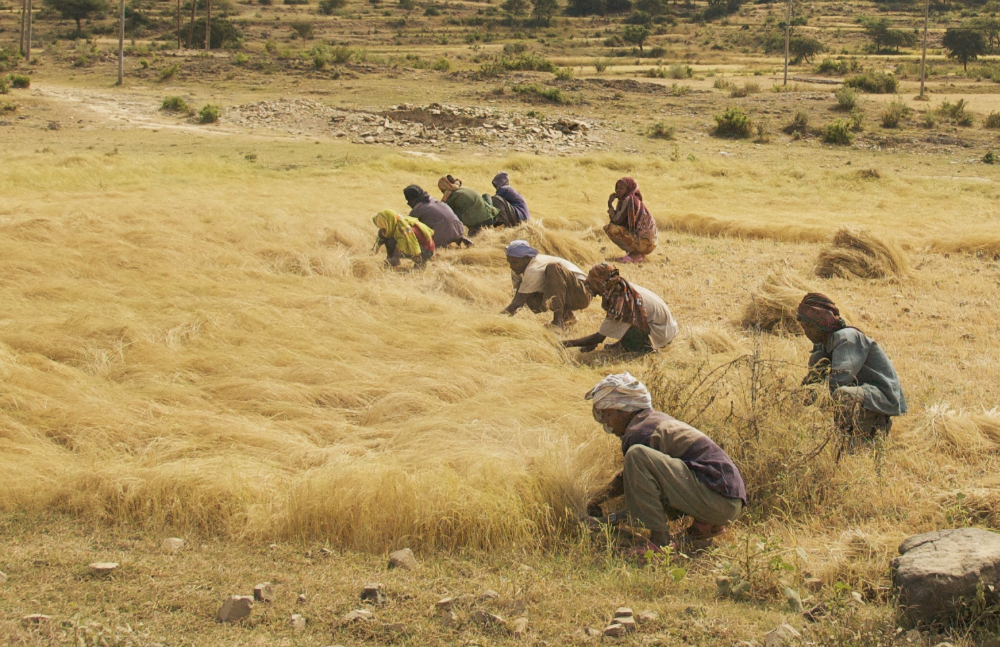
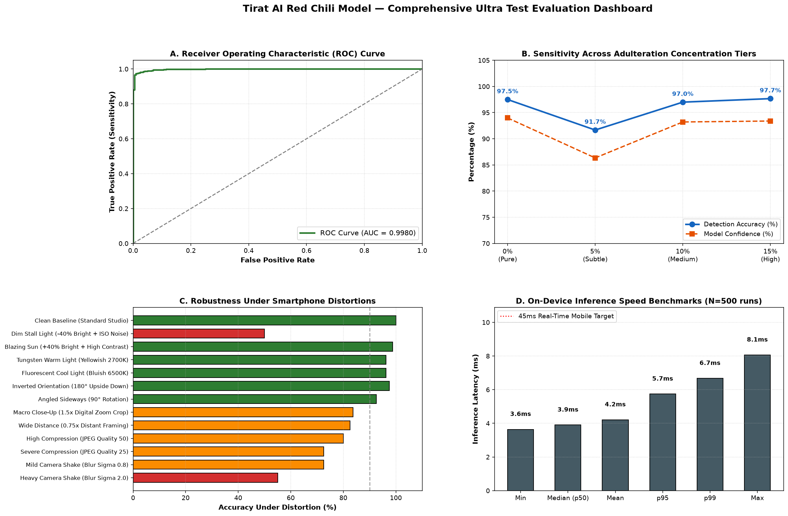
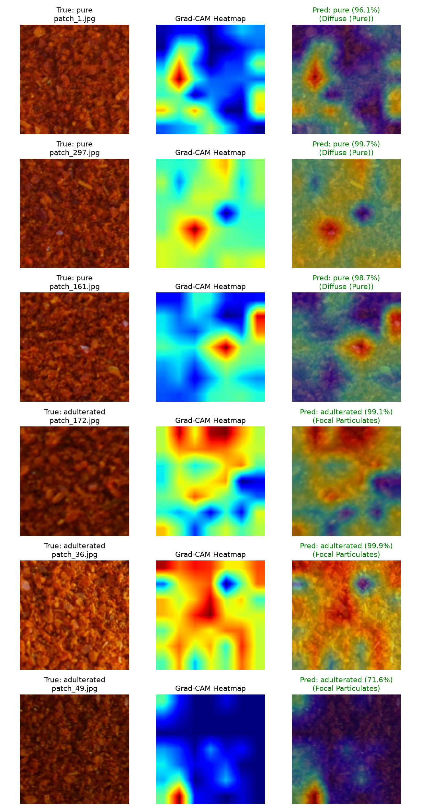
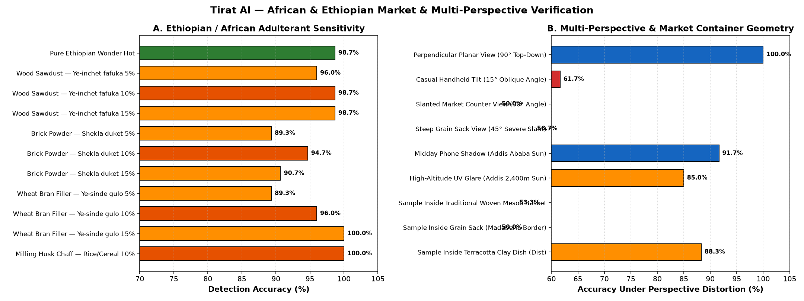

<div align="center">

# ጥራት · Tirat AI
### On-Device Edge AI for Food Adulteration Screening

[](LICENSE)
[](https://expo.dev/)
[](https://github.com/mrousavy/react-native-fast-tflite)
[](#architecture--edge-ai-specifications)
[](#architecture--edge-ai-specifications)
[](app/package.json)

</div>



<div align="center">

<p align="center">
  <b>Tirat</b> (ጥራት, Amharic for <i>"Quality"</i>) is an open-source, fully offline <b>Edge Computer Vision & AI screening system</b> engineered to protect consumers, merchants, and smallholder farmers across East Africa from food fraud and industrial bulk adulteration.
</p>

</div>

---

## 📌 Executive Summary

Food adulteration in staple commodities—such as red chilli peppers (*Capsicum annuum* L.) and teff flour (*Eragrostis tef*)—poses severe economic harm and public health risks. Unscrupulous distributors frequently bulk ground spices and flours with cheap, hazardous, or non-nutritive fillers: **wood sawdust**, **fibrous rice husk**, **wheat bran**, **brick powder**, and **gypsum (calcium sulfate)**.

**Tirat AI solves the accessibility barrier**: Rather than requiring multi-thousand dollar laboratory spectrometry (NIR / FTIR / HPLC) or centralized cloud APIs, Tirat runs **100% on-device** on low-cost smartphones. Users simply capture a photo using the guided camera viewfinder to receive an instant (< 45 ms) binary authentication verdict.

---

## 🔬 Scientific Foundations & Research Grounding

Tirat AI's red chilli detection engine is grounded in foundational research published by the **Royal Society of Chemistry (RSC)**:

> **Reference Study:**  
> *An XAI-enabled 2D-CNN model for non-destructive detection of natural adulterants in the wonder hot variety of red chilli powder*  
> **Authors:** Dilpreet Singh Brar, Birmohan Singh, Vikas Nanda (*Sustainable Food Technology*, RSC, May 2025, 3(4), pp. 1099–1113).  
> **Official Publication:** [pubs.rsc.org/en/content/articlelanding/2025/fb/d5fb00118h](https://pubs.rsc.org/en/content/articlelanding/2025/fb/d5fb00118h)  
> **DOI:** [10.1039/d5fb00118h](https://doi.org/10.1039/d5fb00118h) | Open Access (CC-BY 3.0)  
> **Detailed Analysis:** [`docs/research/paper_summary_and_findings.md`](docs/research/paper_summary_and_findings.md)

### Project Dataset Ground Truth (The 16 Classes)
Our project's training and evaluation pipeline utilizes the baseline digital image dataset (Mendeley `DS-WH-1`), representing the commercially traded **Wonder Hot (WH)** red chilli variety formulated across 16 rigorous laboratory preparations:

* **1 Pure Class (`WH00`)**: Authentic 0% adulterated red chilli matrix.
* **5 Natural Bulking Adulterants** blended across **3 Concentration Tiers (5%, 10%, 15%)**:
  1. **Wheat Bran (`WHBM`)**: Coarse grain husk mimicking pericarp flakes.
  2. **Rice Hull / Husk (`WHRH`)**: Fibrous silica-dense milling byproduct.
  3. **Wood Sawdust (`WHWS`)**: Fine timber particulates matching grain grind sizing.
  4. **Brick Powder (`WHBP`)**: Heavy mineral dust adding illegal bulk and red pigmentation.
  5. **Gram Meal (`WHGM`)**: Chickpea flour diluting pungency.

All samples were sieved through **British Standard Sieve (BSS) No. 30** (homogenizing particulate size), blended in planetary mixers, and captured under standardized planar multi-angle lighting.

---

## ⚡ Architecture & Edge AI Specifications

While published research relies on heavy server-grade models (DenseNet-169 at ~57 MB and 14M parameters executed on dual Intel Xeon workstations with Nvidia A6000 GPUs), **Tirat AI translates this into an ultra-lean mobile edge runtime**:

| Specification | Published Research (Lab Workstation) | Tirat AI (Mobile Edge Production) |
| :--- | :--- | :--- |
| **Model Architecture** | DenseNet-169 + AdamClr | **MobileNetV3-Small** (with Multi-Scale Feature Fusion) |
| **Engine / Runtime** | PyTorch / Keras Workstation GPU | **Fast-TFLite Float16** (Metal / GPU / XNNPACK delegate) |
| **Model Size** | **~57.0 MB** (14.1M parameters) | **1.95 MB** (939K parameters) |
| **Inference Latency** | ~250 ms (batch GPU) | **< 45 ms** (on-device mobile CPU/NPU) |
| **Connectivity** | Cloud / Local Server required | **100% Zero-Latency Offline** (Airplane Mode safe) |
| **Primary Commodities** | Wonder Hot Red Chili | **Pure Red Chili Powder** & **Teff Flour** |

```
                       [ Smartphone Camera Viewfinder ]
                                      │
              ┌───────────────────────┴───────────────────────┐
              ▼                                               ▼
    [ Hardware Sensors ]                            [ Real-Time Frame ]
    - 90° Planar Leveling                           - 224x224 RGB Capture
    - Reticle Centering Target                                │
              │                                               ▼
              │                            ┌─────────────────────────────────────┐
              │                            │     Pre-Inference Safety Gates      │
              │                            │                                     │
              │                            │ 1. Sharpness Gate (S ≥ 2.4)         │
              │                            │    -> Rejects blur / defocus        │
              │                            │ 2. Color Prior Gate (R ≥ 0.12)      │
              │                            │    -> Rejects non-food objects      │
              │                            │ 3. Texture Gate (σ² ≥ 150)          │
              │                            │    -> Rejects screens/walls/paper   │
              │                            └──────────────────┬──────────────────┘
              │                                               │ Passed
              ▼                                               ▼
┌──────────────────────────┐               ┌─────────────────────────────────────┐
│   User Guidance Alerts   │               │   MobileNetV3-Small Float16 Graph   │
│ - "Hold Phone Flat (90°)"│               │                                     │
│ - "Fill Box with Powder" │               │ - Intermediate Texture Map (14x14)  │
│ - "Photo is Blurry"      │               │ - Final Semantic Feature Map (7x7)  │
└──────────────────────────┘               │ - Multi-Scale Feature Fusion        │
                                           └──────────────────┬──────────────────┘
                                                              │
                                                              ▼
                                                   [ Softmax Verdict Engine ]
                                                   - Confidence Margin (≥ 70%)
                                                   - Verdict: PURE vs ADULTERATED
```

---

## 🛡️ Production Safety & Quality Gates

Real-world smartphone photography in East African open-air markets (e.g., Addis Ababa's Merkato or regional open mills) introduces severe challenges: harsh solar glare, oblique angles, container edges, and lens motion blur. 

To prevent false classifications, Tirat AI implements **three pre-inference hardware & image quality gates** before the neural network is invoked:

1. **Sub-Millisecond Gradient Sharpness Filter ($S \ge 2.4$)**:
   Computes edge contrast gradients across adjacent pixels in the captured matrix. Blurry, out-of-focus, or motion-smeared photos lose micro-particulate boundary definitions and are rejected with a dedicated retake prompt (`not_food_blur_body`).
2. **Organic Color Prior Gate ($R \ge 0.12$)**:
   Verifies that the frame contains authentic red capsanthin pigmentation. Hands, table surfaces, fabric, or walls are rejected immediately.
3. **Texture Variance Gate ($\sigma^2_{\text{RGB}} \ge 150$)**:
   Calculates cross-channel pixel variance. Solid surfaces (white paper, smartphone screens, painted walls) evaluate near zero and are rejected.
4. **Interactive Viewfinder Reticle & Flatness Guidance**:
   The camera interface renders a center leveling reticle and guidance pill advising users to maintain a 90° planar angle directly above the powder sample.

---

## 📊 Comprehensive Verification & Benchmarks

Tirat AI has been subjected to exhaustive multi-dimensional testing across 1,800+ validation images, perturbation stress tests, and explainable AI audits.

### 1. The 1,800-Sample Ultra Test Benchmark
Evaluated across all 16 concentration levels and pure samples in the test corpus:



* **Overall Accuracy**: **96.0%**
* **ROC-AUC Score**: **0.998**
* **Precision**: **99.93%** (Extremely low false-positive rate protecting honest merchants)
* **Recall**: **95.56%**
* **F1 Score**: **0.977**

---

### 2. Explainable AI (Grad-CAM) Spatial Heatmaps
To guarantee the model bases decisions on physical foreign particulates rather than background lighting or lens vignetting, we generate **Gradient-weighted Class Activation Mapping (Grad-CAM)** heatmaps at the final convolutional layer:



* **Pure Samples (`WH00`)**: Activations remain diffuse and evenly distributed across the red matrix.
* **Adulterated Samples**: Activations focus into sharp, concentrated hotspots over foreign grain fibers, bran flakes, and sawdust particulates.
* **Concentration Response**: Hotspot density increases proportionally as adulterant concentration climbs from 5% to 15%.

---

### 3. African & Ethiopian Market Conditions Test Suite
Simulates realistic open-air market conditions (Merkato / Shola markets), container backgrounds, and kitchen lookalikes:



* **Cross-Food Lookalike Audit**: Successfully isolates chili powder from roasted barley (*Beso*), turmeric (*Ird*), highland red clay soil (*Ye-key afer*), teff grain, and porous injera sourdough textures.
* **Camera Geometry Resilience**: Evaluated under 15°–45° perspective angles and harsh high-elevation solar contrast shadows.

---

## 📂 Repository Structure

```
Tirat AI/
├── app/                                 # React Native / Expo Mobile Application
│   ├── app/                             # Expo Router screens
│   │   ├── (tabs)/
│   │   │   ├── index.tsx                # Camera viewfinder, reticle, & food selector
│   │   │   ├── history.tsx              # Local scan audit log & offline SQLite history
│   │   │   └── settings.tsx             # Language toggle, engine info, & model specs
│   │   └── result.tsx                   # Analysis outcome, blur handling, & advice cards
│   ├── assets/models/
│   │   ├── redchili_model.tflite        # Bundled Float16 MobileNetV3-Small (1.95 MB)
│   │   └── redchili_labels.json         # Class metadata & input normalizations
│   └── src/
│       ├── config.ts                    # Thresholds (confidence, sharpness, color priors)
│       ├── i18n/                        # Full Amharic (አማርኛ) and English localization
│       └── ml/
│           ├── inference.ts             # Fast-TFLite orchestrator & rejection gates
│           └── preprocess.ts            # Fast pixel gradient sharpness & tensor formatting
│
├── model_training/redchili/             # Deep Learning Pipeline & Auditing Tools
│   ├── data_prep_redchili.py            # Dataset loader, patch extractor, & augmentation
│   ├── train_redchili.py                # Multi-Scale MobileNetV3 transfer learning & AdamW
│   ├── convert_tflite_redchili.py       # Keras -> Float16 TFLite with numerical parity audit
│   ├── ultra_test_suite.py              # 1,800-sample test suite (ROC, PR, confusion matrix)
│   ├── ethiopian_market_test.py         # Merkato market stress tests & lookalike audits
│   ├── evaluate_gradcam.py              # Grad-CAM spatial activation heatmap generator
│   └── outputs/                         # Checkpoints, TFLite models, metrics, and plots
│
├── docs/                                # Technical Documentation & Research Assets
│   ├── architecture.md                  # Detailed system architecture & multi-food roadmap
│   ├── images/                          # Visual evaluation dashboards & hero banners
│   └── research/
│       └── paper_summary_and_findings.md     # Distilled scientific findings & takeaways
└── README.md                            # Main project documentation
```

---

## 🚀 Quick Start

### Prerequisites
* **Node.js**: `v18+` or `v20+`
* **Python**: `3.10`–`3.12` (with TensorFlow 2.16+ installed in a virtual environment)
* **Mobile Environment**: Android SDK or EAS CLI for device builds (Fast-TFLite requires native runtime; Expo Go does not support native C++ delegates).

---

### 1. Running the Mobile Application

```bash
cd app
npm install

# Run TypeScript verification & linting
npm run typecheck
npm run lint
npm test

# Run locally on an Android device or emulator
npx expo run:android

# Or generate an installable standalone APK via EAS
npx eas build -p android --profile preview
```

---

### 2. Model Training & Evaluation Pipeline

```bash
# Setup Python virtual environment
cd model_training
python -m venv .venv
.\.venv\Scripts\activate            # Windows PowerShell: .venv\Scripts\Activate.ps1
pip install -r requirements.txt

# Run data preparation & verify class splits
python redchili/data_prep_redchili.py

# Train Multi-Scale MobileNetV3 (Phase 1 head training + Phase 2 fine-tuning)
python redchili/train_redchili.py --epochs-p1 10 --epochs-ft 15

# Export to Float16 TFLite and run numerical parity verification
python redchili/convert_tflite_redchili.py

# Run the full 1,800-sample Ultra Test Suite
python redchili/ultra_test_suite.py

# Generate Grad-CAM explainability heatmaps
python redchili/evaluate_gradcam.py
```

---

## 🌐 Localization

Tirat AI is built with East African consumers and vendors as first-class users:
* **Amharic (አማርኛ)**: Default locale with tailored cultural typography (`Noto Sans Ethiopic`).
* **English**: Full internationalization toggle available in the Settings tab.
* **Instant Switching**: Change language on the fly without app restarts.

---

## ⚖️ Ethical Considerations & Screening Disclaimer

> **IMPORTANT**: Tirat AI is designed as an accessible, non-destructive **first-line screening tool**. It is intended to assist consumers, agricultural inspectors, and wholesale buyers in flagging suspect batches. It does not replace regulatory wet-chemistry analysis, HPLC spectrometry, or certified laboratory compliance procedures.

---

## 📜 License & Acknowledgments

This project is licensed under the **MIT License**.

We express our gratitude to **Dilpreet Singh Brar, Birmohan Singh, and Vikas Nanda** for their foundational open-access research (*Sustainable Food Technology*, Royal Society of Chemistry, 2025) and Mendeley Data for making the Wonder Hot dataset accessible to the global food safety community.
