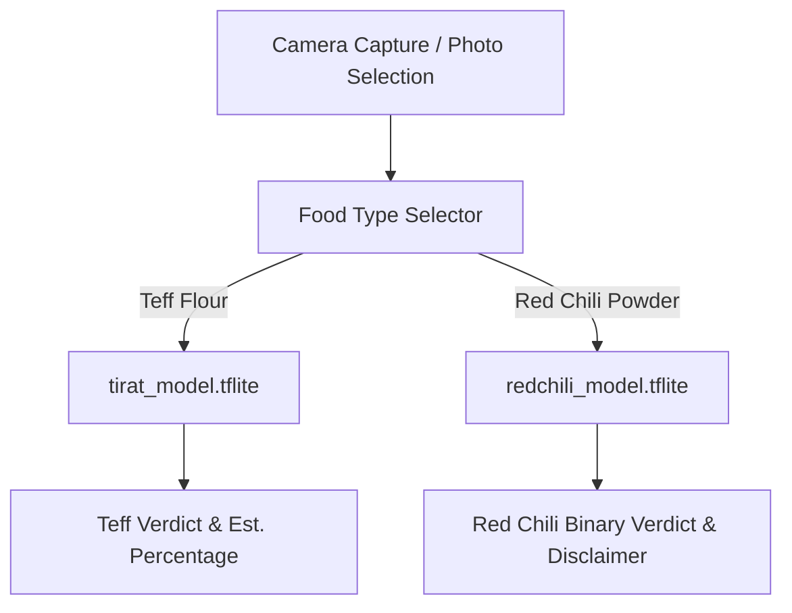

# Tirat AI (ጥራት) Architecture Overview

## Overview
Tirat (ጥራት) is a mobile computer vision application for detecting food flour and powder adulteration using on-device machine learning (MobileNetV3Small quantized TFLite models via `react-native-fast-tflite`).

---

## Multi-Food Support

Tirat AI supports parallel detection pipelines for multiple food commodities without coupling model structures:

### 1. Teff Flour Adulteration (`teff`)
- **Location**: `model_training/` (Teff training scripts) and `app/assets/models/tirat_model.tflite`
- **Output Heads**: Dual-head MobileNetV3Small:
  - Verdict classification: `pure`, `wood`, `gypsum`
  - Concentration estimation: Percentage bins (10% - 40% w/w)

### 2. Red Chili Powder Adulteration (`redchili`)
- **Location**: `model_training/redchili/` (Red chili training scripts) and `app/assets/models/redchili_model.tflite`
- **Dataset**: Mendeley Red Chilli Adulteration Digital Image Dataset (DS-WH-1)
- **Output Head**: Binary classification (`pure` vs. `adulterated`)
- **Adulterants in Dataset**: Natural bulking agents verified by Brar et al. (RSC, 2025): **Wheat Bran (WB)**, **Rice Husk / Hull (RH)**, and **Wood Sawdust (WS)** across 16 concentration gradations (0% to 30% in 2% steps).
- **Disclaimer**: Red chili detection is trained on a public reference dataset and displays an in-app notice that it is not yet validated on local market samples.

#### Scope Decision: Binary-Only (v1)
Red Chili model (v1) uses **binary classification only** — the output is `pure` or `adulterated` with a confidence score. Percentage-level adulteration detection (16 concentration tiers, e.g. 2%, 4%, ... 30%) is **planned for v2**, building on the paper's multi-class findings.

The dataset folders (`WHBM_5/10/15`, `WHGM_5/10/15`, `WHWS_5/10/15`, etc.) encode percentage levels in their names, but these were **collapsed to binary** for this phase. The app-side UI never displays a percentage figure for red chili results — `estPct` is always `null` in the red chili inference path, and all display guards (`estPct != null`) prevent any percentage from rendering.

This is an intentional scope decision, not an undocumented limitation.

---

## Technical Pipeline

### Preprocessing & In-Graph Normalization
All preprocessing (rescaling `0..255` float values) is baked directly into the Keras model graph before TFLite export. This guarantees zero train/serve skew across platforms.
